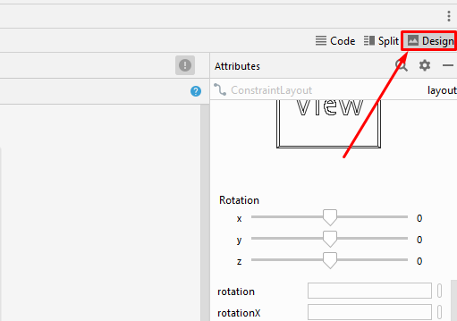

# Como desarrollar interfaces con la herramienta _Desgin UI_

### [Link del código de la aplicación ](https://github.com/raulop194/DesingUI-Task05.git)

## Requisitos
- Android Studio
- Cualquier emulador o simulador conectado por el pueto ADB ( Android Data Bridge )

## Preparativos
1. Habiendo creado previamente una aplicación de plantilla ___Empty Activity___, nos dirigiremos a _app/src/main/res/layout/activity_main.xml_ y lo abriremos

2. En caso de que no este abierto el modo de __diseño interactivo__, pulsaremos en el boton indicado en la imagen de abajo:



## Comenzando
Antes de continuar con el desarrollo de la interfaz gráfica, debemos entender ciertos conceptos básicos para el desarrollo de interfaces en Android.

En Android, las interfaces se constuyen a partir de componentes, lo cuales tienen sus atributos, se localizan descritos en el apartado de la derecha ( ___Attributes___ ) que describen el como se deben de comportar. Estos te los puedes encontrar en apartado de la izquierda llamada ___Palette___, y para utilizarlos solo habria que arrastrarlos al ___Blueprint___; es la parte que se encuentra en el medio de esta ventana que otorga una vista previa del layout actual.

Una vez entendido estos conceptos, empezemos:

1. Buscaremos el componente ___Plain Text___ y lo posicionaremos __como en la imagen__. Lo podremos localizar en el apartado _Text_.


Le añadiremos ademas la _id_ __avatar_text__ en el apartado de atributos.

2. Ahora haremos lo mismo con el componente ___Button___ el cual se puede encontrar en el apartado _Buttons_.


Le añadiremos ademas la _id_ __avatar_send__ en el apartado de atributos.

Para ligar los unos componentes con otros, arrastraremos el punto que hay en el centro de los bordes de los compontentes al del otro componente.

3. Manteniendo pulsado la tecla _Ctrl_ clicaremos los dos componente antes puestos, y acto seguido, daremos click derecho, ___Chains > Create Horizontal Chain___. Con esto conseguiremos que estos dos objetos tengan un tamaño flexible.

4. Teniendo los dos seleccionados tambien podremos mover los dos componentes a la vez, con lo que lo posicionaremos donde cada uno queramos, siempre y cuando respete lo que mustra la imagen de abajo.


5. Ya solo fataria poner el componente ___ImageView___, localizado en __Widgets__. Le añadiremos la _id_ __avatar_image__. Asegurate de tener unido a los bordes del layout.

Con esto habremos terminado la parte de la interfaz, con que solo faltaria definir el como se debe de comportar la _actividad_.

El siguiente código lo define:

```kotlin
class MainActivity : AppCompatActivity() {

    private val DEFAULT_TAG = "default" // El valor por defecto del tag de imagenAvatar.

    private lateinit var imageAvatar: ImageView // Objeto que contendra el cuador de imagen.
    private lateinit var userAvatar: TextView // Objeto que contendra el campo de texto.
    private lateinit var sendAvatar: Button // Objeto que contendra el boton de acción.

    override fun onCreate(savedInstanceState: Bundle?) {
        super.onCreate(savedInstanceState)
        setContentView(R.layout.activity_main)

        // Referenciamos por id los objetos del layout.
        imageAvatar = findViewById(R.id.avatar_image)
        userAvatar = findViewById(R.id.avatar_text)
        sendAvatar = findViewById(R.id.avatar_send)

        imageAvatar.tag = DEFAULT_TAG // Establecemos el tag por inicial de imageAvatar.
        sendAvatar.setOnClickListener { handleImageChange() } // Cuando el boton se pulse ejecuta
                                                              // el metodo handleImageChange().
    }

    /**
     * A partir de el valor que este almacenado en el valor de userAvatar, cambia la imagen con su
     * tag de imageAvatar.
     * */
    private fun handleImageChange() {
        val name = userAvatar.text.toString() // Obtendremos el valor de userAvatar como String.

        // Obtendremos un hashmap con la id y un tag para la imagen, apartir de lo introducido.
        val resource = when (name.lowercase()) {
            "pepe" -> hashMapOf("id" to R.mipmap.pepe,
                                "tag" to "pepeImage")
            "laura" -> hashMapOf("id" to R.mipmap.laura,
                                 "tag" to "lauraImage")
            "maria" -> hashMapOf("id" to R.mipmap.maria,
                                 "tag" to "mariaImage")
            else -> hashMapOf("id" to R.drawable.ic_launcher_foreground,
                              "tag" to DEFAULT_TAG)
        }

        // Si el tag no es el mismo; cambia el recurso de imagen y el tag a imageAvatar.
        if (resource["tag"] != imageAvatar.tag){
            imageAvatar.setImageResource(resource["id"] as Int)
            imageAvatar.tag = resource["tag"] as String
        }

    }
}
```
con esto ya habremos terminado el desarrollo de aplicación.

## Resultado
Ahora compilaremos y ejecutaremos en el emulador que tengamos conectado.


Si funciona tal y como el _GIF_ muestra, significa que se habramn seguido bien los pasos.

## Troubleshooting

Es posible que te encuantres problemas durante el desarrollo, por eso aqui se detallaran pasos extra en caso de que te aparezca una error:

1. __Las no se encuantran las images utilizadas__ - Aunque no se haya especificado en lo pasos anteriores, __se deben de poner las imagenes que cada uno quiera dentro de una de las carpetas de _res___ y referenciarlas dentro del codigo en esta parte: 

```kotlin
    // Obtendremos un hashmap con la id y un tag para la imagen, apartir de lo introducido.
    val resource = when (name.lowercase()) {
        "pepe" -> hashMapOf("id" to R.mipmap.pepe,
                            "tag" to "pepeImage")
        "laura" -> hashMapOf("id" to R.mipmap.laura,
                            "tag" to "lauraImage")
        "maria" -> hashMapOf("id" to R.mipmap.maria,
                            "tag" to "mariaImage")
        else -> hashMapOf("id" to R.drawable.ic_launcher_foreground,
                            "tag" to DEFAULT_TAG)
        }
```

2. __No arranca la aplicacion en mi emulador__ - Recuerda que para poder instalar una aplicacion en un dispositivo Android, tiene que tener activar __el puerto depuracion ADB__; en caso de que ser físico en __Ajustes > Opciones de Desarrollador > Depuración USB__

